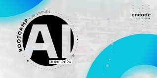

This is a [Next.js](https://nextjs.org/) project bootstrapped with [`create-next-app`](https://github.com/vercel/next.js/tree/canary/packages/create-next-app).

<div align="center">

</div>
<div align="center">

[](https://github.com/90barricade93/my-ai-app/commits/main)


</div>

# MY-AI-APP
Lessons 5 and 6 product - Encode Club AI BootCamp 24Q2

## Description
This project encompasses two lessons: Lesson 5 and Lesson 6, from the Encode Club AI BootCamp.

### Lesson 5
In Lesson 5, we began by setting up our development environment with Node.js and npm, refreshed our JavaScript skills, and were introduced to the Vercel Next.js AI SDK. By the end of this lesson, we created a ChefGPT application using a custom personality developed during our weekend project.

### Lesson 6
During Lesson 6, we enhanced the ChefGPT application by adding several new features:

**Random Recipe Generation:** 
Implemented a button that generates a random recipe.
**Image Generation:** 
Added functionality to generate images based on the recipes.    
**Text-to-Speech (TTS):** 
Incorporated TTS capabilities to read recipes aloud.

## Possible error message:
Following message is possible due to the safety system:       
 ```
 Error: 400 Your request was rejected as a result of our safety system. Your prompt may contain text that is not allowed by our safety system.
```
(refresh the page and try again)
## Conclusion 
The project demonstrates the integration of Next.js, Vercel AI SDK, OpenAI, and various AI concepts. It allows you to randomly generate recipes, then generate an image based on the recipe and read recipes aloud.

### Acknowledgements
I would like to thank the [Encode Club AI BootCamp](https://github.com/Encode-Club-AI-Bootcamp) for this opportunity and [@mpagani](https://github.com/MatheusDaros) for his guidance.

<div align="center">

 &ensp; © Raymond - AI 24Q2 &ensp; 	 

</div>

--------